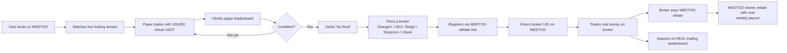
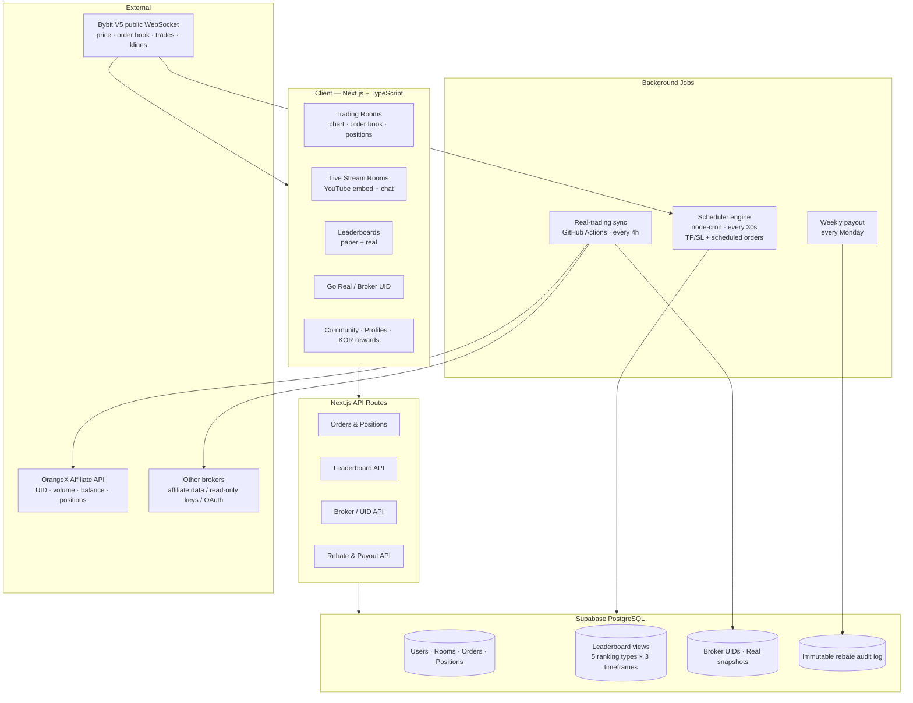
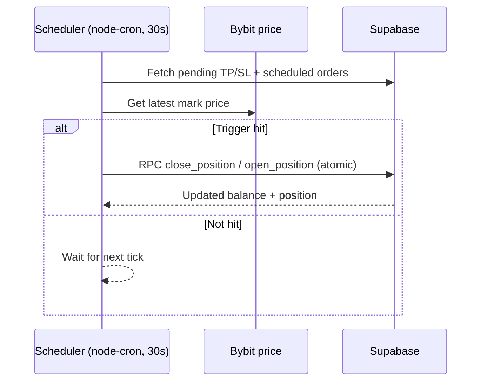
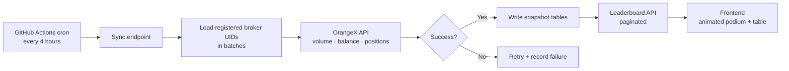

# Weetoo-Build-Story
# From Idea to Acquisition: How We Built WEETOO, a Crypto Trading Community for Korea

> A founding engineer's field notes on building a live-streaming + paper-trading + real-trading platform, the APIs we wired in, the mistakes that almost cost us user trust, and what got the product acquired.

**Author:** Divyanshu Verma (DV) · Founding Engineer → Senior Software Developer, Solomon Partners
**Product:** [weetoo.io](https://weetoo.io)
**Stack:** Next.js · TypeScript · Supabase (PostgreSQL + RLS) · Bybit V5 WebSocket · OrangeX Affiliate API · GitHub Actions · Vercel

---

## TL;DR

- WEETOO started as one sentence: *let traders watch real traders, practice with virtual money, then go real — and share the broker rebate with them.*
- I joined as the founding engineer and took it from idea → working product → acquired by **TetharMax**.
- We shipped paper trading rooms, live-stream rooms, paper and **real** trading leaderboards, a multi-broker "Go Real" flow, and a rebate payout system, closing with **168/168 QA tests passing**.
- The biggest lesson: in a trading product, **one wrong number destroys trust faster than any missing feature.**

---

## Table of Contents

1. [The Idea](#1-the-idea)
2. [The Business Model in One Diagram](#2-the-business-model-in-one-diagram)
3. [Architecture](#3-architecture)
4. [How We Added Each API](#4-how-we-added-each-api)
5. [Major Things We Included](#5-major-things-we-included)
6. [Major Faults We Realised (and How We Fixed Them)](#6-major-faults-we-realised-and-how-we-fixed-them)
7. [Going to Market With Zero Users](#7-going-to-market-with-zero-users)
8. [The Acquisition](#8-the-acquisition)
9. [Lessons for Anyone Building a Trading Product](#9-lessons-for-anyone-building-a-trading-product)

---

## 1. The Idea

Korean retail crypto traders are some of the most active in the world, but the learning path is broken:

- Beginners jump straight into leveraged futures with real money and get liquidated.
- "Pro traders" on social media post screenshots nobody can verify.
- Exchanges pay affiliates large rebates, but the trader who generates the volume usually sees none of it.

WEETOO's founders wanted one place that fixes all three:

> **Watch** a real trader stream → **Practice** the same setup with virtual money → **Prove** yourself on a leaderboard → **Go Real** on a partner exchange → **Get paid back** part of the rebate.

My job was to turn that into software, fast.

---

## 2. The Business Model in One Diagram

The important property: **WEETOO is never out of pocket.** Users are only paid from commission the broker has already paid us. Paper trading is free, and every user who goes real keeps generating revenue with no extra work on our side.

---

## 3. Architecture

**Key design decisions**

| Decision | Why |
|---|---|
| Supabase PostgreSQL with **Row Level Security on every table** | A trading app leaks money if one user can read or write another's positions. RLS makes that a database guarantee, not an app-code hope. |
| **RPC functions** for opening/closing positions | Balance deduction and position creation must happen atomically. Doing it in two API calls invites race conditions and phantom balances. |
| **Pre-computed PostgreSQL views** for leaderboards (15 views) | Ranking every user on every request does not scale. Views keep leaderboard reads cheap. |
| **Immutable audit log** for rebate balance changes | When money is involved, you need to answer "why is my balance X?" for every single row. |
| Public market data straight from **Bybit V5 WebSocket** | Real prices, real order book, no need to run our own market data infrastructure. |

---

## 4. How We Added Each API

### 4.1 Market Data — Bybit V5 Public WebSocket

The paper trading engine needed prices that feel exactly like a real exchange.

- Subscribed to Bybit's public WebSocket for **price ticks, order book, recent trades, and klines**.
- Supported 10 perpetual pairs: `BTCUSDT, ETHUSDT, BNBUSDT, XRPUSDT, SOLUSDT, ADAUSDT, SUIUSDT, DOGEUSDT, LINKUSDT, DOTUSDT`.
- Market orders fill at the current Bybit price with a **5% max price deviation check**, so a stale tick can never fill an order at a crazy price.
- Limit orders reserve margin on placement and release it on cancel; a client-side matcher checks each WebSocket tick.

We also simulated **real exchange fees** (0.05% open taker, 0.06% close taker, 0.50% maintenance margin, plus a 0.25% buffer for isolated margin). If paper trading is more forgiving than real trading, users "go real" with false confidence and blow up. Realistic fees made the paper results honest.

### 4.2 Scheduler Engine — TP/SL and Scheduled Orders

Some orders can't wait for the user's browser to be open.

- **TP/SL orders** are validated against both entry price and liquidation price before they're accepted.
- **Scheduled orders** come in two flavours: time-based and price-based.

### 4.3 Live Streaming Rooms — YouTube Embed

We didn't build a video platform. Streamers go live on YouTube, and WEETOO embeds the stream next to:

- the streamer's **open positions in real time** (entry, mark, PnL),
- live chat with **donations/gifts**,
- a **"Go Real →"** button always one click away.

Choosing not to build streaming infrastructure saved months.

### 4.4 Broker Integration — The "Go Real" Problem

This was the hardest part of the whole product, and it was a business problem as much as a technical one.

Every broker exposes different data through different programmes. We mapped five brokers into **three integration methods**:

| Method | What we get | Approval needed? | Used for |
|---|---|---|---|
| **Affiliate API** | UID verification, trade history, trading volume | Already have it as affiliate | All brokers at launch |
| **User read-only API keys** | Balance + open positions | No | Brokers that allow user keys |
| **Broker Program / OAuth** | Full real-time account data | Yes, 1–4 weeks | Progressive upgrades |

Rules we enforced for user API keys:

- **Read-only keys only.** We explicitly tell users *not* to enable trading or withdrawal permissions.
- **AES-256 encryption at rest**, with the encryption key in environment variables, never in the database.
- Clear copy: *WEETOO only reads your balance and positions. We never trade or withdraw on your behalf.*

The Go Real button supports **multiple brokers**, never hardcoded to one:

1. User clicks **Go Real**
2. Picks a broker from the list
3. Redirected to the broker's signup with our affiliate tracking
4. Creates the broker account
5. Enters their **broker UID** back on WEETOO
6. Their real trading activity is now tracked

### 4.5 OrangeX API — The Real Trading Leaderboard

Paper leaderboards are fun. **Real** leaderboards with verified numbers are what make people trust a platform.

We added two new OrangeX methods (**balance** and **positions**) on top of the affiliate data and built a sync pipeline:

What shipped in that push:

- 2 new OrangeX API methods (balance + positions)
- 4 new database tables, all with RLS
- Automated cron every 4 hours via GitHub Actions
- Batch processing, retry logic, failure tracking
- Paginated leaderboard API + per-user positions API
- 12 edge cases handled
- Verified end to end against **real OrangeX account data**

Ranking rule we settled on: rank by monthly trading volume; users with zero volume but real assets still appear (at the bottom) so the board doesn't look empty and they're nudged to trade; users with zero volume **and** zero assets are hidden.

### 4.6 Rebate Payout System

The final piece before revenue:

- **Automated weekly settlement, every Monday**
- Flow: broker commission received → WEETOO calculates each user's share → auto-transfer to the user's registered wallet
- **Minimum payout threshold of 1 USDT** to avoid micro-transactions eating fees
- Every balance change written to the immutable audit log

---

## 5. Major Things We Included

- **Paper trading rooms**: 100,000 virtual USDT, market / limit / scheduled / TP-SL orders, cross and isolated margin, realistic fees
- **Live stream rooms**: YouTube embed, live chat, donations, streamer positions visible in real time
- **Risk Calculator**: position size at risk, liquidation-by-leverage tables, cross vs isolated aware
- **Leaderboards**: win rate, profit rate, activity (XP), sponsored, across daily / weekly / monthly
- **Real trading leaderboard** from verified broker data
- **Go Real** multi-broker flow with UID registration
- **Exchange comparison** with payback rates per broker
- **KOR coin rewards** with withdrawal tiers
- **Bronze / Silver / Gold certification badges** for traders
- **Shareable trade posters** for social media
- **Community boards and profiles**
- **Weekly rebate payouts**
- **168/168 QA tests passing** at handover

---

## 6. Major Faults We Realised (and How We Fixed Them)

### Fault 1: The PnL sign was inverted

During a screen-recorded review we caught a long position where price had gone **up** but PnL showed a **loss**. The formula was using `(entry − mark)` for longs instead of `(mark − entry)`. The same broken calculation was reused in the share-trade poster, and new positions showed an instant fake loss right after opening.

**Why it mattered:** any experienced trader would spot it within seconds and never come back. One line of code was enough to make the whole platform untrustworthy.

**Fix:** corrected the formula everywhere it was used, then verified all four cases mathematically against live positions:

| Position | Price moves | Expected | After fix |
|---|---|---|---|
| Long | Up | Profit | ✅ |
| Long | Down | Loss | ✅ |
| Short | Up | Loss | ✅ |
| Short | Down | Profit | ✅ |

**Lesson:** in trading software, correctness of numbers is the product. Test PnL like you test payments.

### Fault 2: TP/SL validation could be bypassed

Some confirm paths let an order through with an invalid TP/SL, and switching between Long and Short carried over values that made no sense for the new direction.

**Fix:**
- Confirm is now blocked on invalid TP/SL in **every** confirm path
- Long/Short selection syncs with the TP/SL panel; invalid carry-over auto-corrects to direction defaults (Long: TP +3%, SL −2.5%; Short: TP −3%, SL +2.5%)
- Non-blocking warning for extreme TP targets, scaled by leverage (>10% under 5x, >5% at 5–9x, >3% at 10x+)

### Fault 3: Hardcoded assumptions

The quantity unit was hardcoded to `BTC` even in an ETH room. The Risk Calculator ignored margin mode and told users to "Set a Stop Loss" when they already had one on their open position.

**Fix:** quantity unit is now derived from the room's base asset; the liquidation formula supports cross vs isolated; the calculator falls back to the open position's TP/SL and quantity.

### Fault 4: The leaderboard only showed paper trading

The founders' core loop depended on users seeing **real traders with verified results**. We had only paper numbers, and the "real" part was considered blocked on broker approvals.

**Fix:** instead of waiting, we launched with what we already had (affiliate API data), then added OrangeX balance and positions and shipped the real leaderboard. Other brokers plug into the same pipeline as their approvals land. **Ship with what you have; upgrade progressively.**

### Fault 5: Test data that looked like a bug

Multiple test accounts showed identical balances on the real leaderboard. It looked broken. It wasn't: they were all linked to the same single broker UID we had for testing.

**Lesson:** explain test limitations to stakeholders *before* they see the demo, not after.

### Fault 6: Temporary endpoints drifting toward production

We added a manual trigger route to test the sync. It was useful and dangerous.

**Fix:** deleted it before production and confirmed nothing referenced it. Every temporary route gets a removal task on the day it's created.

---

## 7. Going to Market With Zero Users

The product was done. The user count was zero. The deadline was **one month to show revenue**.

What we did:

- **Day-1 global outreach** to India, Nigeria, the Philippines and the UAE, where retail futures trading is growing fast, and found early real leads
- **Pro-trader programme**: get working traders to stream on WEETOO for 10 days and bring education, not hype
- A **co-launch proposal for Flipster** and a creator outreach pipeline
- A clear, simple money explanation for leadership: *starting from $0, here is exactly how one user turns into recurring rebate revenue*

---

## 8. The Acquisition

WEETOO was acquired by **TetharMax**.

What I think made it acquirable:

1. **A complete loop, not a feature list.** Watch → practice → prove → go real → get paid back. Every piece existed and worked.
2. **Verified real data.** The real trading leaderboard turned "trust me" into "check the numbers."
3. **A revenue model with no inventory risk.** Rebates are paid out only after they're collected.
4. **Quality you could measure.** 168/168 QA tests, and the trust-breaking bugs fixed and verified.
5. **Extensible broker architecture.** New brokers plug into the same pipeline.

After the product shipped and sold, I was promoted from Founding Engineer to **Senior Software Developer**, and the same team moved on to build [MarketLens](https://market-lens.io), an AI chart analysis tool for Korean traders.

---

## 9. Lessons for Anyone Building a Trading Product

1. **Wrong numbers are worse than missing features.** Test PnL, liquidation and fees like payment code.
2. **Make paper trading as harsh as real trading.** Real fees, real slippage checks, real liquidation.
3. **Put security in the database.** RLS on every table, atomic RPCs for money movement, an immutable audit log.
4. **Don't build what you can embed.** YouTube for streams, Bybit for market data.
5. **Don't wait for approvals to ship.** Launch on the data you have; design the pipeline so better data slots in later.
6. **Read-only keys, encrypted, always.** Never ask for more permissions than you need.
7. **Distribution is a second product.** A finished platform with zero users is still at zero.

---

*If you're building in fintech or crypto, or you have an AI-generated app that's falling over in production, I'm happy to talk.*

**Divyanshu Verma** · [GitHub @devs-dv](https://github.com/devs-dv) · [LinkedIn](https://www.linkedin.com/in/dev-divyanshuverma) · [X @devsdv_](https://x.com/devsdv_) · [dotdevdesigns.com](https://dotdevdesigns.com)
